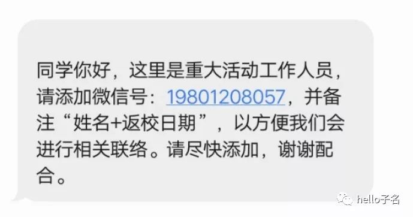
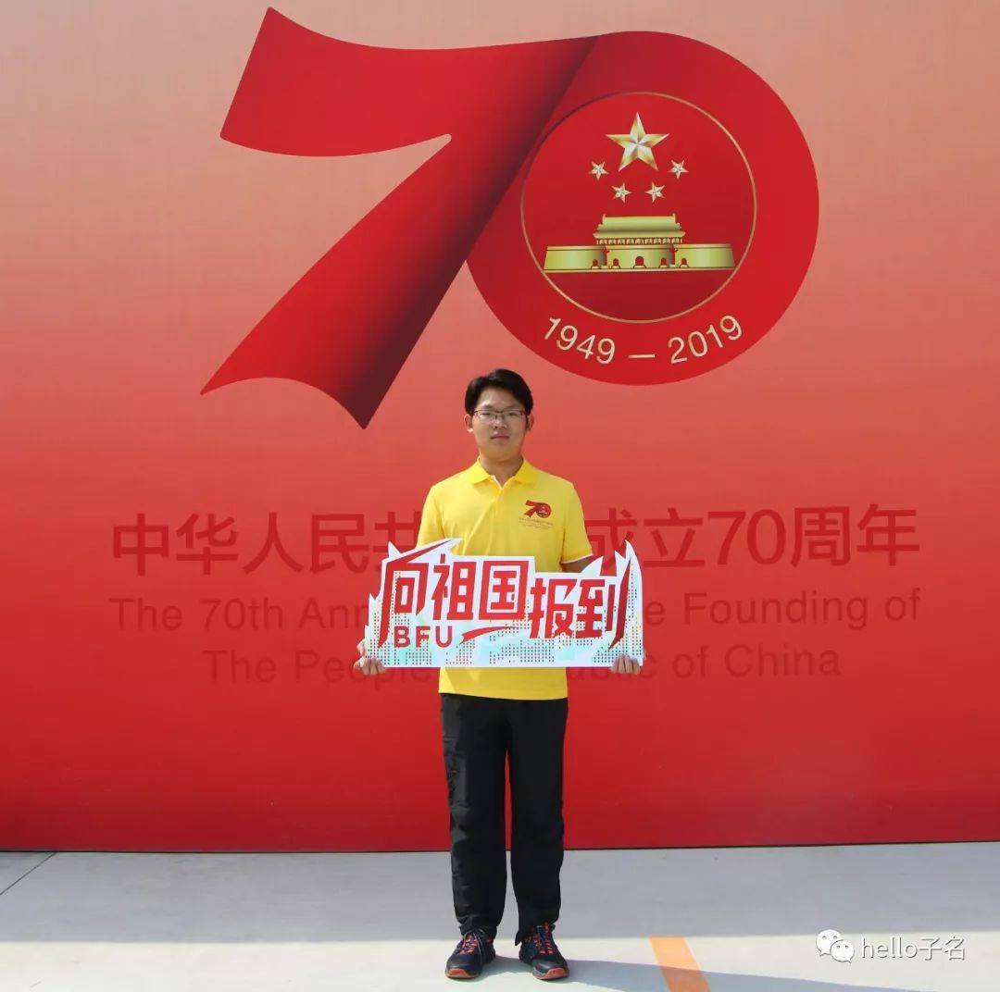
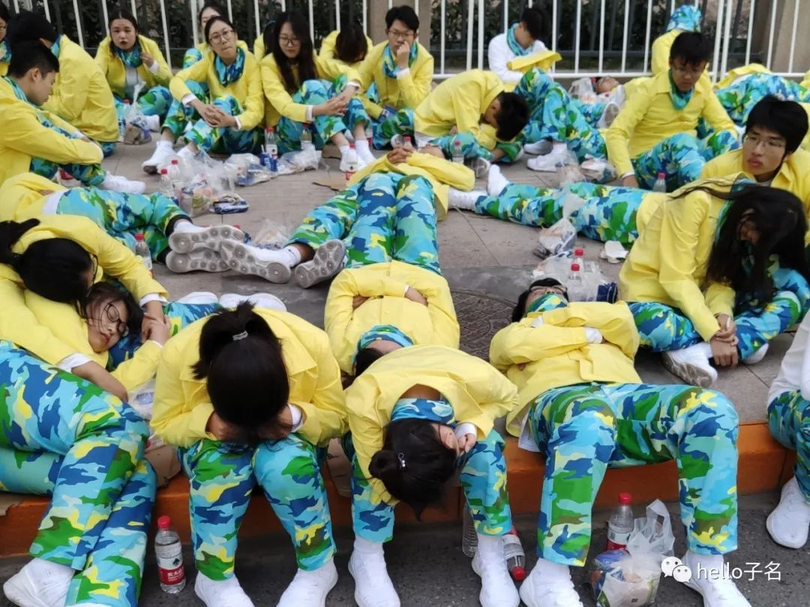
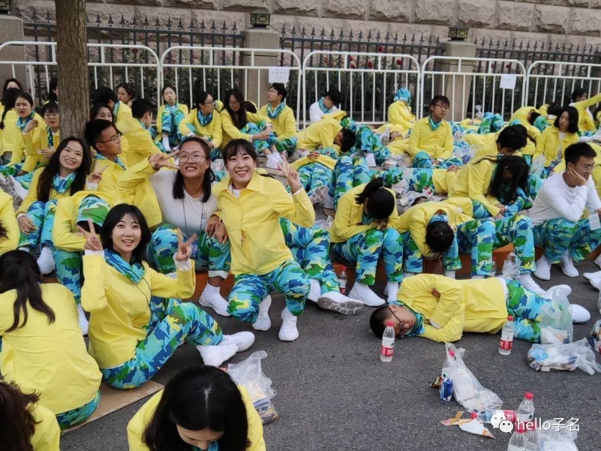
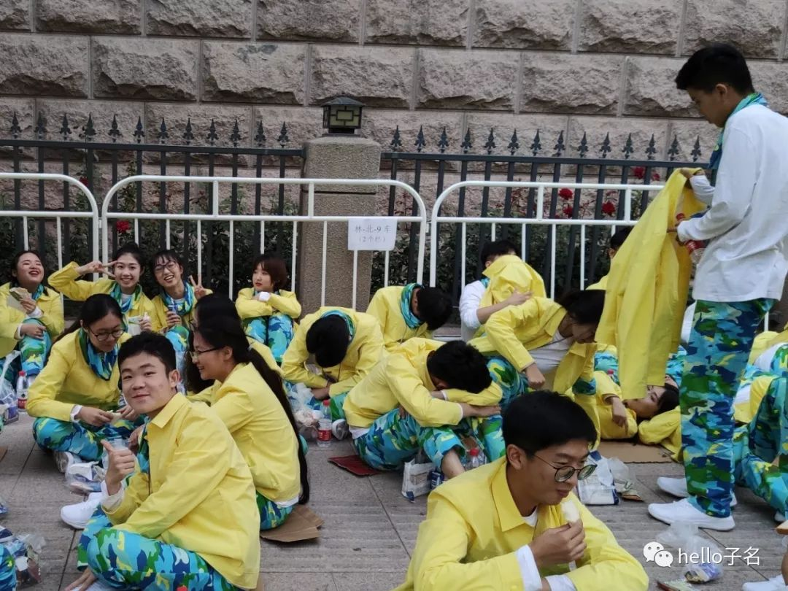
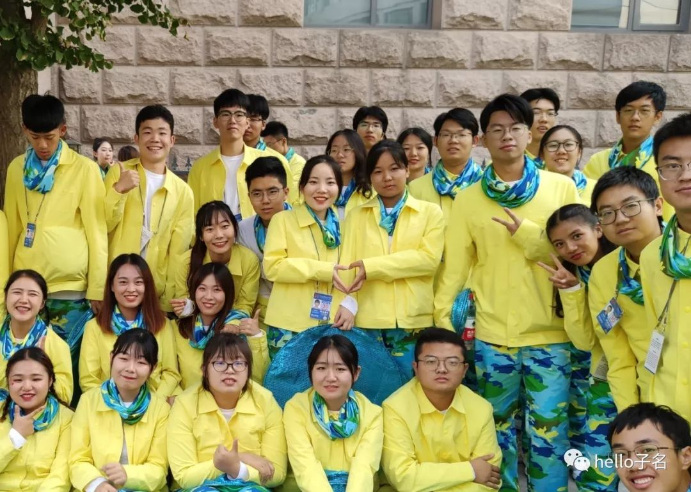

2019是10月1日国庆节，是庆祝新中国成立70周年的纪念日，在天安门广场举行了盛大的阅兵式和群众游行，作为10万游行群众中的一员，我感到十分的幸运与激动！顺便分享一下我参与这次游行的经历。

# 开始总是那么的美好

大概是在7月份的12或13号，经过了自动申请--学院审核--学院答辩等环节，我们成为了**“十月重大活动”**的志愿者，然后我们在操场进行了“破冰之旅”！大家都很开心，而我也作为队里可怜少数男生，成为了后勤保障员，并进行日常训练。大致是每天下午3点半，晚上7点左右开始训练，每次2个多小时。由于是学校体育老师们进行训练，所以比较轻松，而且吃得好，喝的好，还有同学们在一起聊天，感觉很开心。唯一觉得有压力的就是进行体能训练，每天在操场跑8圈，比较辛苦。

15号左右学校进行了国庆庆祝活动启动仪式，同学们都很兴奋，当**“向祖国报道”**的徽标悬挂在无人机上在田家炳内飞翔时，大家的掌声不绝于耳，非常整齐庄严。

# 初选失利，梦想几乎破灭

16号的时候接到通知，说我们是按照110%选拔参加活动人员的，今晚将会淘汰3%，其余7%作为替补，考核淘汰的方式为队列训练。晚上进行了简短的准备，我们开始考核，就是一排人一起从起点走到终点，要求步幅步速控制在每秒两步，每步60公分的标准，然后不合格的会被筛掉。当时我们那个队伍很长，走的队列很偏很斜，但因为是普遍现象，所以也就没有在意。

一个晚上，加上第二天上午，各种猜测都有，心里也很慌，但始终抱有一丝希望，但是就在第二天下午我收到短信，为第二梯队候补。**也就是说，我不仅是替补，连第一梯队替补都不是。**当时真的很难过，心情也非常复杂，但最后还是冷静下来。

# 几经折腾，再次回归

八月上旬的两三天时间里，我陆续收到信息，事情出现转机。然后我就赶紧离家赴京，准备接受训练，结果刚到就遭遇打击：由于队形调整，**我们又从正式队员转为替补**。因此有的同学选择在家留守，有的同学像我一样在京等待。终于我们这些留守在京的同学开始了跟队训练，但那些在家的就再也没有了消息（这也告诉我们**：一份付出一份回报**）。

# 跟队训练，迎来转机

八月中下旬我们开始了四次左右的跟队训练，前两次我们扮演彩车，帮同学们进行“前四后三左右二”的定位训练。后来的训练我们就成为了捡垃圾，发水，帮忙打杂的后勤员。我们的训练意志也有些消磨，期间我还迟过道，因睡过头差点坐不了车，幸亏我们中队长是个非常好的人，训练还过得去。等到了九月份，有三次在天安门进行的全要素彩排，一次也没有让我们替补去，真的觉得希望在不停破灭。   

直到9月28号，事情迎来转机，因为前一天晚上我们领到了正式衣服，中队长也在暗示我们有机会上场。当天队列调整，对朱鹮的位置重新布局，我们候补全部上场，我被分在第九中队，靠近北侧彩车，内心真的很开心。就这样，我们准备充分，同时补充体能，准备10.1日的正式群众游行。

# 夜不能寐，永生难忘

终于到了9.30号晚上，我们穿好衣服前往乘车点集合（我还差点忘了围脖），然后一起拍照，分发物资，在领导们的欢送中出发，当时才10.1日的凌晨1点半。

五道口还是那么堵，从**北林--清华--北大东门--中关村--五棵松--八宝山**一路上几乎没有睡着。然后开始列队--安检--乘地铁，一直到东单下车，迅速集结到长安街北侧的**全国妇联和交通运输部的胡同口**，期间各种武器装备都被我们给看了一遍。然后我们开始吃饭，直接接躺地上开始睡。（以下四图均有我~）

10点左右，我们听到了礼炮的声音，知道庆祝大会已经开始了，于是我们就到路口戒严区，希望能通过DF-100之间的夹缝看到总书记检阅三军的身影，此时国歌声起，我们都站立起来奏唱国歌，很感动。然后伴随着熟悉的声音，总书记在我们的视角里出现，虽然距得很远，视角也不清楚，但总书记的身影非常高大，总书记乘车回来的时候我们又看了一眼，然后迅速集结，准备出发。

集结期间我们看到了各种武器，可爱帅气的兵哥哥，以及需要在指定位置集结的各个彩车和彩车上的人，如老英雄模范群体，还有**吴京、王祖蓝、雷军、朱婷、张维为、武大靖**（真人比照片还帅）等，我们激动地向他们打招呼，真的很激动！！!然后我们的“绿水青山”彩车开过来了，我们迅速混合包夹，然后开始向前出发。期间我们不停的在向马路两侧的所有志愿者，士兵，拍摄者们打招呼，还几次以为要和兵哥哥们打招呼把队伍都搞乱了，不过都迅速恢复了。

最激动人心的时刻到了，伴随着30方阵出发的口令，我们进入了核心受阅区，我们先按照要求做动作，队列很整齐，动作很娴熟。然后就是向主席台打招呼，我们每个人都拼命的向天安门欢呼，我和大家一样激动的蹦了起来，高喊共产党万岁。在经过天安门时，总书记站立起来向我们打招呼，表情很慈祥，由于我们距离天安门很远，所以总书记站立起来后成为我们所有人关注的焦点，那一刻，觉得总书记真的十分伟大。与此同时我们不断和观众互动，保持欢愉。走过核心区，我们依旧不能冷静下来，继续欢呼雀跃，向路两侧所有的人，包括后面驶来的彩车拼命打招呼，心情久久不能平静，长安街成为了一片欢乐的海洋。这时候安徽省的彩车经过，我很开心，拿着道具向它和车上的人欢呼，这一刻，我为安徽自豪。然后我们开始疏散，乘车回校。

# 总结

中华人民共和国的七十年是艰苦奋斗，开拓进取的七十年！是中国共产党带领广大人民群众过上好日子的七十年！国庆阅兵式与群众游行十年一次，而对我们每个人来说，一生可能仅此一次，我始终都不会忘记在核心受阅区总书记向我们挥手的画面，永远铭记在心。与此同时，我还想说：**我爱你，中国！！!**